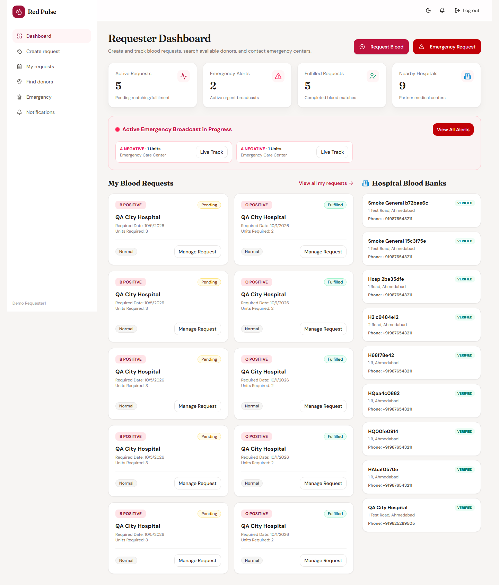
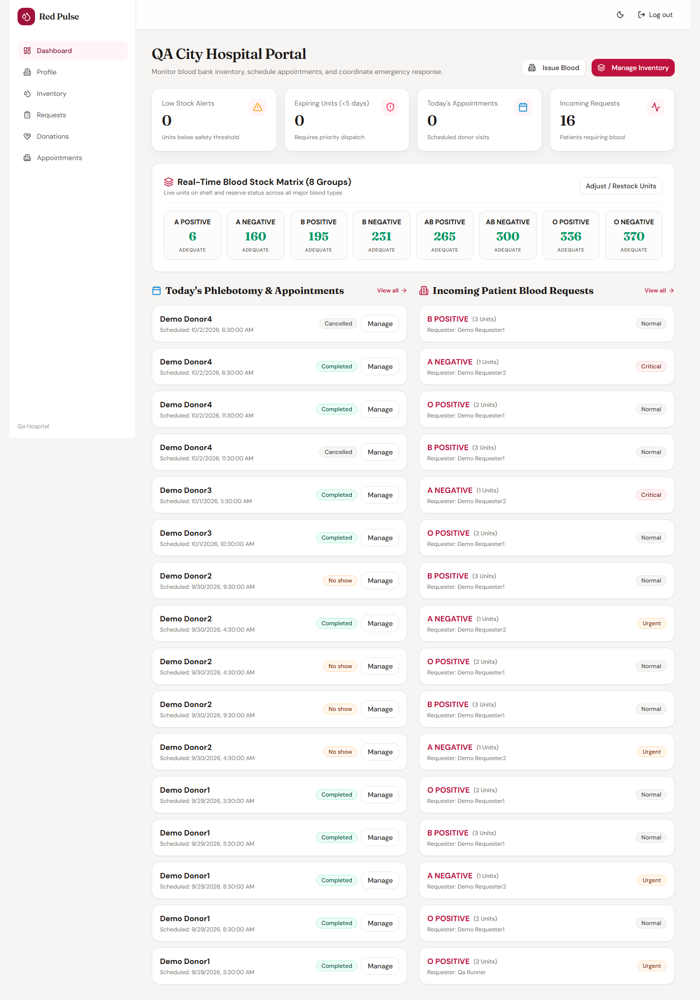
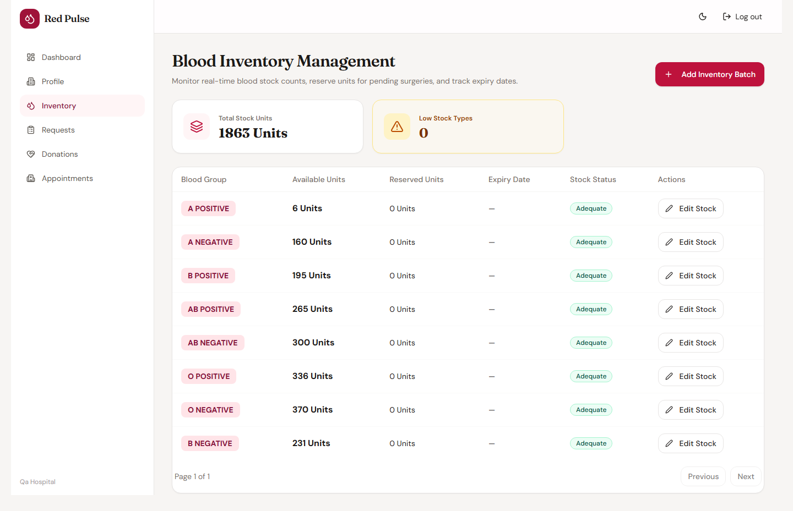
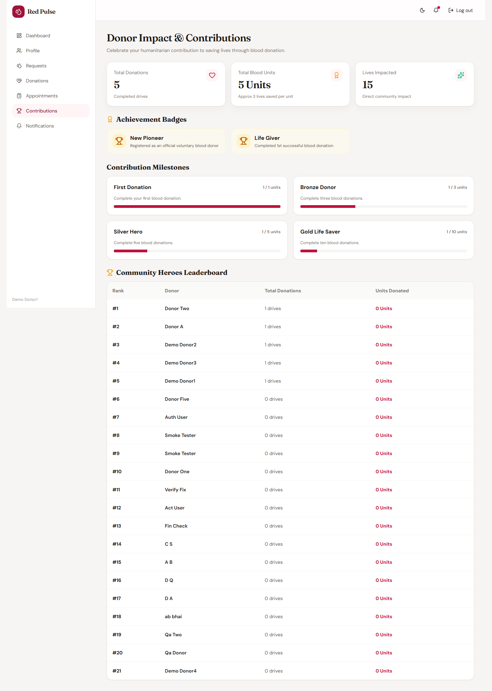
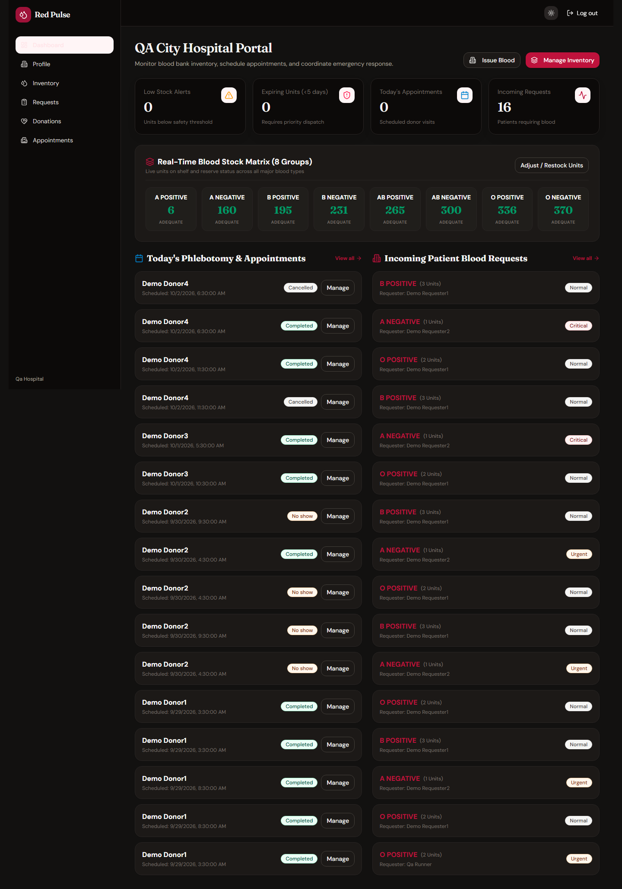
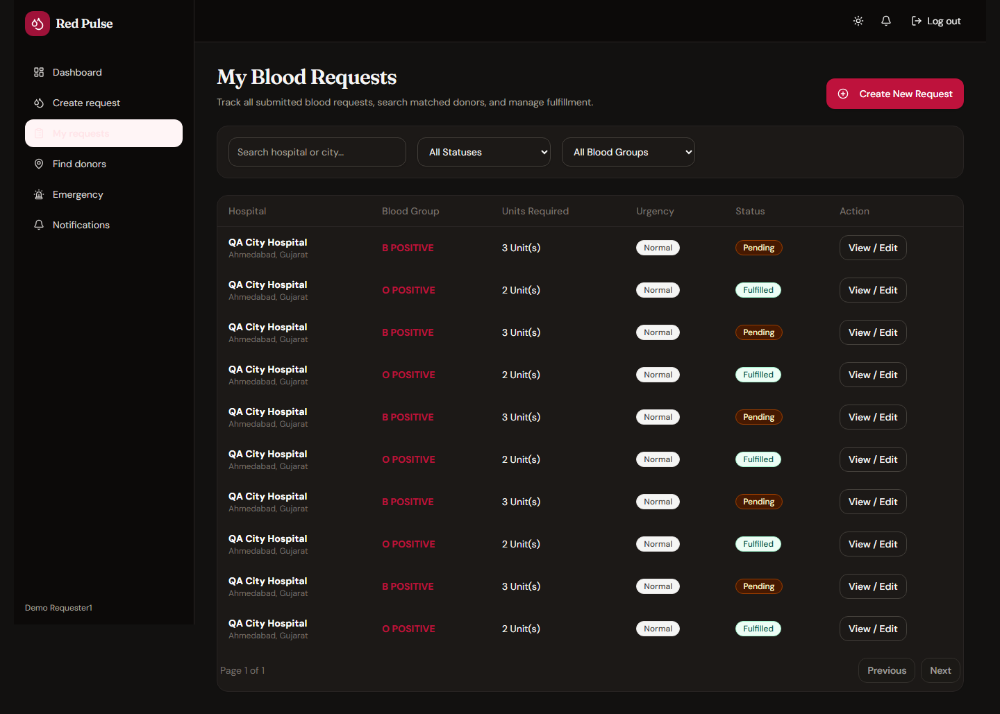

# Red Pulse

A blood donation platform for India. Donors register and book slots, hospitals run
their blood bank and confirm arrivals, requesters raise requests and escalate
urgent ones, and admins oversee the whole thing.

Spring Boot REST API over PostgreSQL, React + TypeScript SPA on top.

## The problem

Coordinating blood donation over phone calls falls apart in the places that
matter. A walk-in donor arrives and the hospital does not know it was out of a
group. An urgent request sits in a queue because there is no way to broadcast it.
Nobody can tell whether a donor is even eligible to give again this month.

Red Pulse turns that into data:

- **Donors** keep a health profile, a donation history, and an eligibility window
  computed from weight, age and time since the last donation rather than typed in.
- **Hospitals** track stock across all eight blood groups, book donors into slots,
  and confirm, complete or mark no-shows.
- **Requesters** raise requests against a hospital and can escalate to an
  emergency broadcast.
- **Admins** verify donors, manage users and hospitals, and read platform reports.

Matching a request to nearby donors happens in the backend, not the browser, so
everyone gets the same answer.

## Screens

All screenshots are of the running app with real data, not mockups.

**Landing page**


**Sign in**


**Requester dashboard** — live emergency broadcast, own requests, nearby blood banks



**Raising a blood request**


**Emergency dispatch**


**Hospital dashboard** — arrivals, stock warnings, pending actions



**Blood inventory** — all eight groups, live counts



**Donor dashboard** — derived eligibility, active cooldown, nearby requests


**Donor impact and milestones**



## Dark theme

The whole app ships with a dark theme, not just a few pages. It is toggled from
the header on both the public site and the dashboards, defaults to whatever the
operating system is set to, and remembers the choice across sessions.



Every data table, form, status badge and chart is styled for it — 278 `dark:`
utilities across 50 components. The screenshots below are the same requester
account you saw earlier, in dark:



It is built on Tailwind's class-based dark variant rather than a second set of
stylesheets, so a component only has to declare its dark colours next to its
light ones:

```css
/* index.css - one declaration enables dark: utilities everywhere */
@custom-variant dark (&:where(.dark, .dark *));
```

```tsx
// ThemeContext.tsx - stored choice wins, otherwise follow the OS
const stored = localStorage.getItem(STORAGE_KEYS.theme);
if (stored === 'dark' || stored === 'light') return stored;
return window.matchMedia('(prefers-color-scheme: dark)').matches ? 'dark' : 'light';
```

The provider toggles a single class on `<html>`, so switching themes costs one
attribute change rather than a re-render of the tree.

## Stack

**Backend** — Java 21, Spring Boot 4.1, Spring Web, Spring Data JPA (Hibernate),
Spring Security, Bean Validation, Flyway, jjwt, PostgreSQL, springdoc-openapi.

**Frontend** — React 19, TypeScript 5.9, Vite 7, React Router 7, TanStack Query 5,
React Hook Form + Zod, Tailwind CSS 4, Recharts, Lucide, Axios, Sonner.

## Architecture

```
React SPA
   │  Axios, Bearer access token
   ▼
Controllers        validate input, map to DTOs, delegate
   ▼
Services           business rules, transactions, ownership checks
   ▼
Repositories       Spring Data JPA
   ▼
PostgreSQL         schema owned by Flyway
```

Backend features are packages under `com.redpulse.modules` — `auth`, `user`,
`hospital`, `donation`, `appointment`, `request`, `inventory`, `matching`,
`notification`, `admin` — each split into `controller` / `service` / `repository` /
`entity` / `dto`. Cross-cutting code sits in `com.redpulse.common` (security,
exceptions, phone validation, OTP store).

A few decisions worth naming:

**Flyway owns the schema, Hibernate only validates it.** Migrations `V1`–`V9`
create every table. The app runs `ddl-auto: validate`, so drift between the
entities and the migrations fails at startup instead of silently altering tables.

**Business rules live in the service layer.** Completing a donation increments
hospital stock, updates the donor's cooldown and advances the appointment — all in
one transaction. The controller has no opinion about any of it.

**Ownership is enforced server-side.** Services compare the record's donor or
hospital against the authenticated actor and throw `ForbiddenException` on
mismatch, so guessing an id does not get you someone else's data. There are 3 such
checks in `DonationService`, 3 in `AppointmentService`, 2 in `NotificationService`.
Frontend route guards exist too, but those are presentation only.

**Matching is a server concern.** `MatchingService` scores donors against a blood
request and their location; the browser only renders the result.

## Roles

| Role | Can do |
|---|---|
| **Donor** | Maintain a health profile, set availability, book appointments, donate, view history, contributions, milestones and badges, see nearby requests |
| **Hospital** | Manage stock per blood group, edit facility details, see appointments, confirm / complete / no-show, review incoming requests, confirm donations and credit stock |
| **Requester** | Raise blood requests against a hospital, track status and matched donors, trigger an emergency broadcast, view notifications |
| **Admin** | Verify donors, block and unblock users, manage hospitals, view platform-wide reports, read the audit trail |

Enforced with Spring Security request matchers plus `@PreAuthorize` on the admin
controllers.

## Security

- **Stateless JWT.** `JwtUtils` issues a short-lived access token and a longer
  refresh token, signed HS256 with a base64 secret from `JWT_SECRET`.
- **BCrypt** password hashing (`PasswordEncoder` bean in `ApplicationConfig`).
- **`SessionCreationPolicy.STATELESS`** — no server-side session store.
- **Layered authorization** — URL matchers for broad areas, `@PreAuthorize` on
  admin controllers, per-record ownership checks in services.
- **Validation at the boundary** — Bean Validation on request DTOs enforced with
  `@Valid`, and one exception handler returning a single consistent error shape.
- **Firebase phone auth** as an alternative sign-in path, verified server-side.

## API

96 endpoints across 15 controllers.

| Area | Base path |
|---|---|
| Authentication | `/api/auth` — register, login, refresh, forgot/reset password |
| Users and donors | `/api/users`, `/api/donors` |
| Hospitals | `/api/hospitals` |
| Inventory | `/api/hospitals/{id}/inventory` |
| Donations | `/api/donations` |
| Appointments | `/api/appointments` |
| Blood requests | `/api/blood-requests` |
| Matching | `/api/blood-requests/{id}/matches`, `/api/donors/nearby` |
| Emergencies | `/api/emergency-requests`, `/api/emergency/otp` |
| Notifications | `/api/notifications` |
| Admin and audit | `/api/admin` |

Swagger UI is served at `/swagger-ui.html` when the app is running.

## Database

PostgreSQL, 15 tables across 9 Flyway migrations.

| Migration | Contents |
|---|---|
| `V1` | users, donor profiles, password reset tokens |
| `V2` | hospitals, blood inventory |
| `V3` | blood requests, emergency requests |
| `V4` | appointments, donations |
| `V5` | notifications, audit logs |
| `V6` | indexes and constraints |
| `V7` | Firebase UID on users |
| `V8` | emergency email verification |
| `V9` | appointment lifecycle columns |

A `donation` belongs to a donor and a hospital and may trace back to an
`appointment`; completing one is what moves inventory. A `blood_request` targets a
hospital and accumulates matched donors; escalating it creates an
`emergency_request`. Appointments link a donor to a hospital slot and move
`SCHEDULED → CONFIRMED → COMPLETED`, with `NO_SHOW` and `CANCELLED` as terminal
alternatives.

## Layout

```
.
├── Red Pulse-Frontend/          React + TypeScript SPA (Vite)
│   └── src/
│       ├── api/                 Axios client, endpoint modules, shared contracts
│       ├── components/          Layout, tables, forms, cards
│       ├── context/             Auth and theme providers
│       ├── pages/               One folder per role: donor, hospital, requester, admin, public
│       ├── routes/              Route table and role guards
│       ├── types/               Shared enums and models
│       └── __tests__/           Vitest suites
│
├── Red-Pulse Backend/           Spring Boot API (Maven)
│   └── red-pulse/
│       ├── src/main/java/com/redpulse/
│       │   ├── modules/         Feature packages
│       │   ├── common/          Security, exceptions, phone validation, OTP
│       │   ├── config/          Security, mail, data initialisation
│       │   └── enums/           Status and domain enums
│       ├── src/main/resources/
│       │   ├── db/migration/    Flyway migrations V1–V9
│       │   └── application*.yml
│       └── pom.xml
│
└── docs/screenshots/            Images used above
```

## Running it

Needs JDK 21, Node 20+, and a PostgreSQL you can create tables in.

**Backend**

```bash
cd "Red-Pulse Backend/red-pulse"
cp .env.example .env      # then fill in the values below

./mvnw spring-boot:run
```

The app reads `.env` directly via `spring.config.import`. It needs `DB_URL`,
`DB_USERNAME`, `DB_PASSWORD`, `JWT_SECRET` (base64 — `openssl rand -base64 48`),
and the two token lifetimes.

Worth knowing: **this build reads the expiry values as milliseconds, not
ISO-8601 durations.** `900000` is 15 minutes. `PT15M` will not parse and the
context fails to start.

API on `http://localhost:8080`, Swagger UI at `/swagger-ui.html`. Flyway applies
migrations on first start, then Hibernate validates the schema against them.

**Frontend**

```bash
cd "Red Pulse-Frontend"
npm install
npm run dev
```

Served on `http://localhost:5173`.

**Admin account** — set `ADMIN_BOOTSTRAP_ENABLED=true` with `ADMIN_EMAIL` and
`ADMIN_PASSWORD` and one admin is created on first start. Local development only.

**Checks**

```bash
cd "Red-Pulse Backend/red-pulse" && ./mvnw test   # 7 tests
cd "Red Pulse-Frontend" && npx tsc -b && npm run lint && npm test   # 9 tests
```

## Tests

Backend: 7 JUnit tests, all passing — context startup, OTP store behaviour,
Indian phone number normalisation, auth-service validation.

Frontend: 9 Vitest tests across 4 suites, all passing — auth, blood requests,
inventory, route table. `tsc -b` and `lint` are clean (lint reports two
`react-refresh` warnings, no errors).

Coverage is thinner than the feature list. The service rules that matter most —
donation completion crediting stock, the donor cooldown calculation, appointment
state transitions — are exercised through the running app but have no unit tests
behind them yet. That is the obvious next thing to add.

## Known issues

Real gaps, found by running the app rather than reading it:

- **The admin analytics charts render empty.** `/api/admin/analytics/overview`
  returns `totalBloodStockUnits: 1980` and a populated `stockByBloodGroup`, but the
  dashboard card reads **0 Units** and all four charts plot nothing. The payload
  shape the frontend expects does not match what the backend sends. The summary
  numbers on that page are correct; the charts and the inventory card are not.
- **The admin donor directory shows an empty name column.** Blood group, weight,
  city and verification status all populate; the name field does not.
- **The audit trail is read-only.** Schema, entity, repository, four endpoints and
  the admin page all exist and `AdminService` writes one entry, but the AOP hook
  meant to record every privileged action (`common/audit/AuditAspect.java`) is an
  empty placeholder, so the page renders an empty table.
- **CSRF protection is disabled** (`csrf.disable()`). Fine for a pure bearer-token
  API where the browser never attaches credentials automatically, but it needs
  revisiting before any cookie-based auth is added.
- **No rate limiting on auth endpoints.** Nothing throttles repeated logins.
- **13 classes are empty placeholders** left from the original scaffold, including
  `common/dto/ApiResponse.java` and `enums/InventoryStockStatus.java`.
- **The donor dashboard greeting renders as "Welcome back, !"** — the user's first
  name is not being read from the profile response.
