# Red Pulse

A blood donation management platform for India. Donors register and book donation
slots, hospitals run their blood bank and confirm arrivals, requesters raise blood
requests and escalate urgent ones, and admins oversee the whole system.

Built as a full-stack application: a Spring Boot REST API over PostgreSQL, and a
React + TypeScript single-page app on top of it.

---

## Overview

Coordinating blood donation by phone and paper breaks down in the places that
matter most — a walk-in arrives and nobody knows the hospital is out of a group,
an urgent request sits in a queue because there is no broadcast, a donor cannot
tell whether they are eligible to give again this month.

Red Pulse models the whole loop as data:

- A **donor** keeps a health profile, a donation history and a derived
  eligibility window. Eligibility is computed from body metrics, age and the time
  since the last donation, not typed in by hand.
- A **requester** raises a blood request against a hospital, and can escalate it
  to an emergency broadcast.
- A **hospital** manages stock across all eight blood groups, books donors into
  slots, and confirms, completes or marks no-shows.
- An **admin** verifies donors, manages users and hospitals, and reads the audit
  trail and platform analytics.

Matching a request to nearby donors is done in the backend rather than in the
browser, so the same result is produced whoever asks.

---

## Screenshots

### Authentication

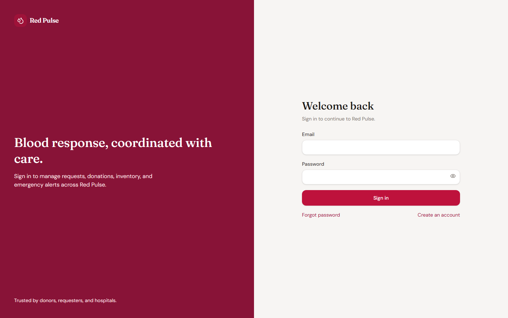

### Public landing page

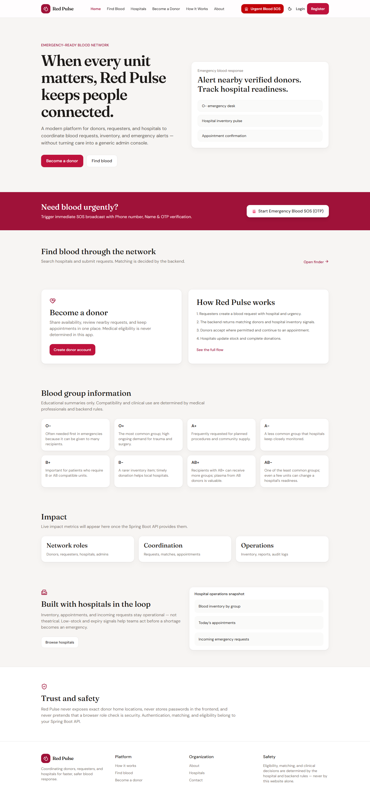

### Admin

| Platform analytics | User management | Donor directory |
|---|---|---|
| 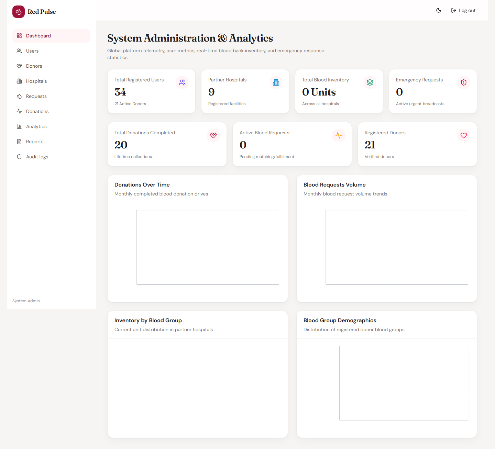 | 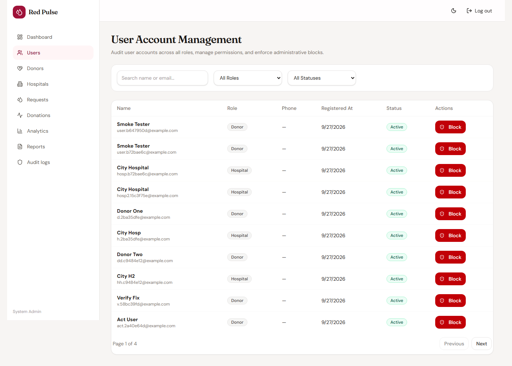 | 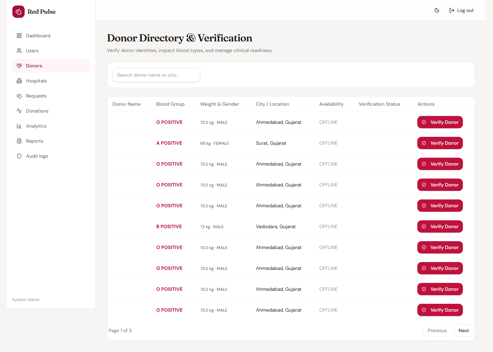 |

Detailed reporting lives behind the Analytics view:

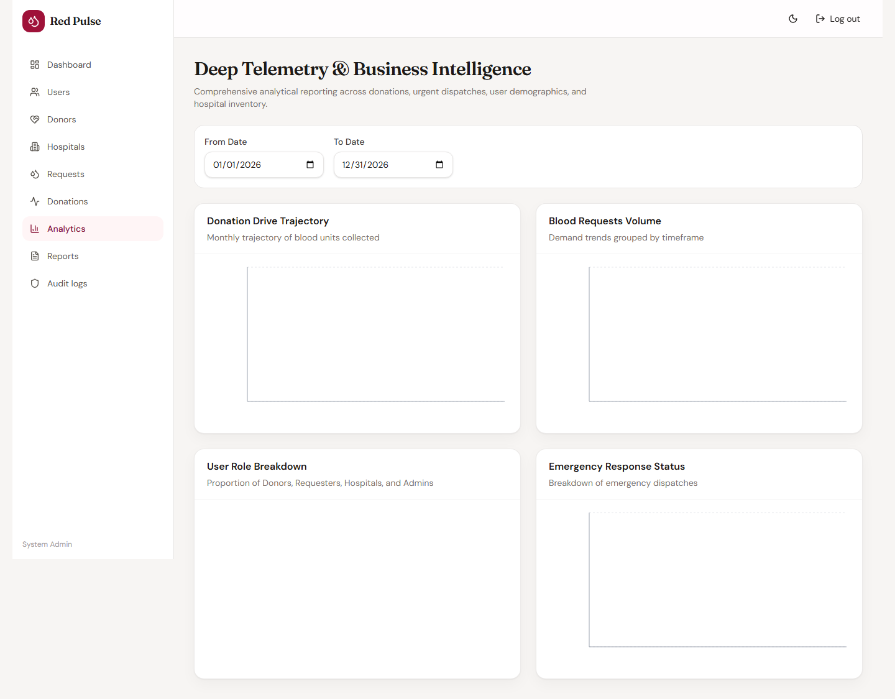

### Donor

| Dashboard | Appointments | Donation history |
|---|---|---|
| 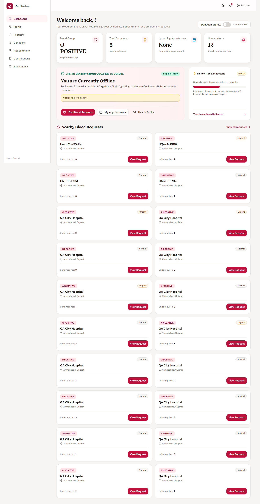 | 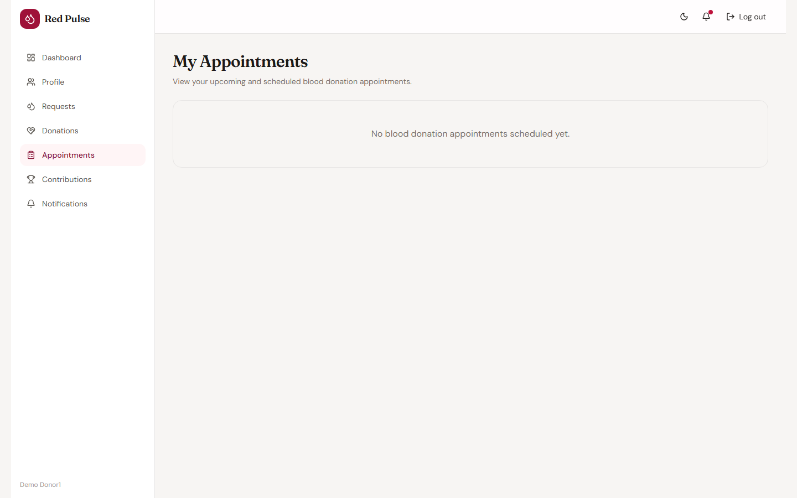 | 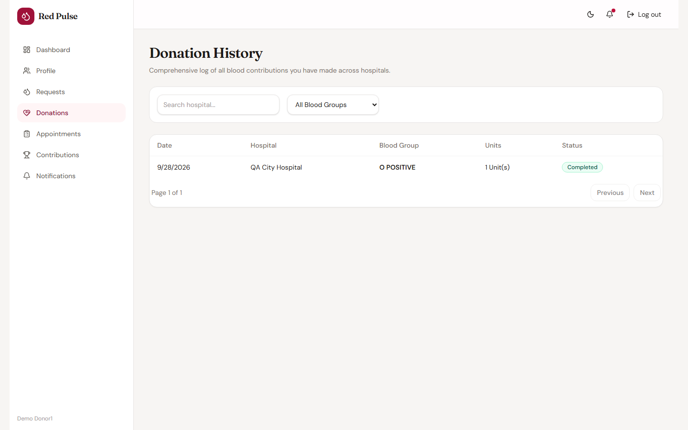 |

The dashboard shows derived eligibility, the active cooldown window, and a
milestone tier:


### Hospital

| Hospital dashboard | Blood inventory | Appointments | Incoming requests |
|---|---|---|---|
|  |  | 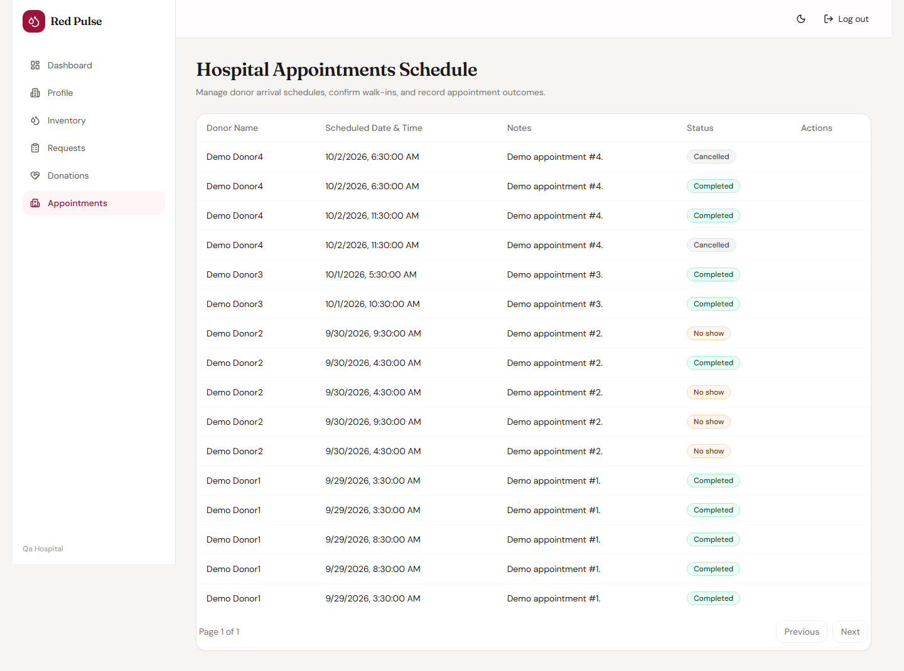 | 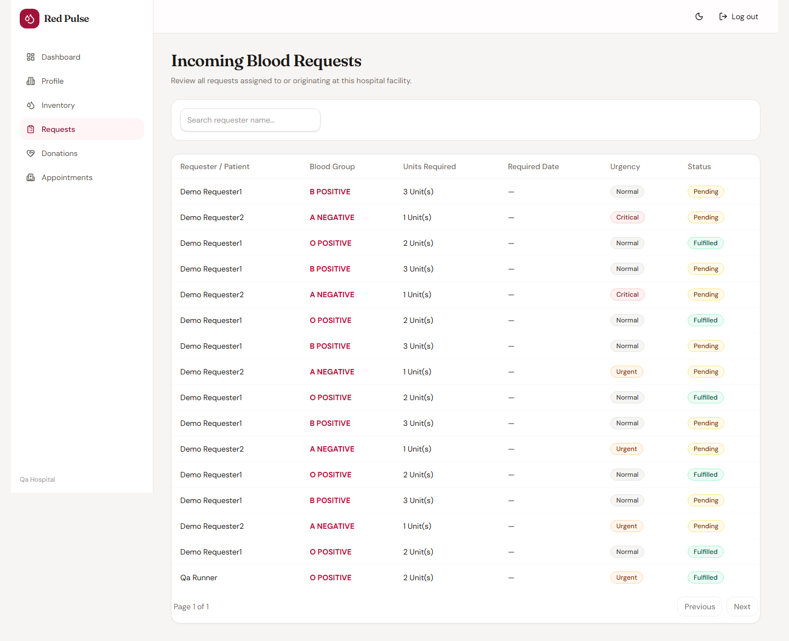 |

### Requester

| Requester dashboard | Raise a request | My requests | Emergency dispatch |
|---|---|---|---|
|  | 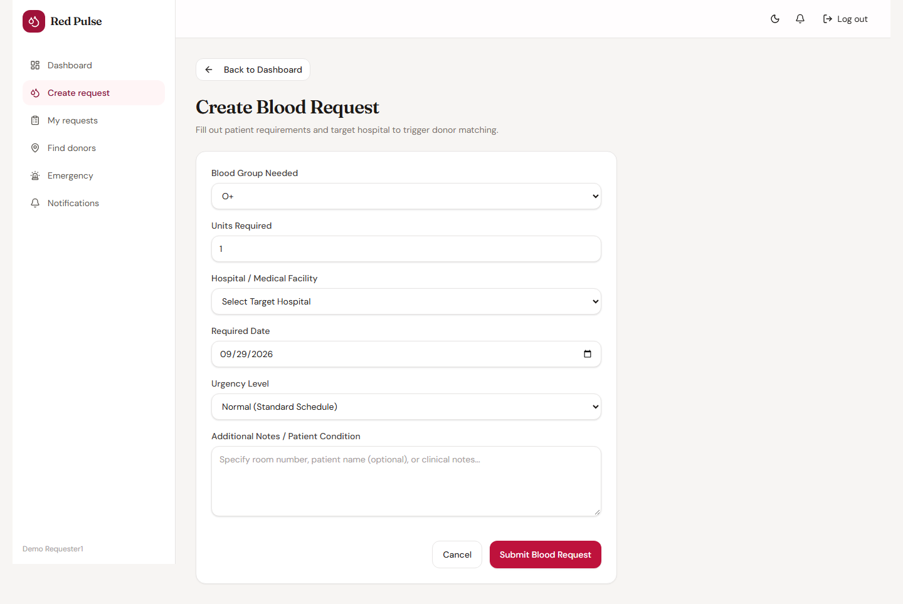 | 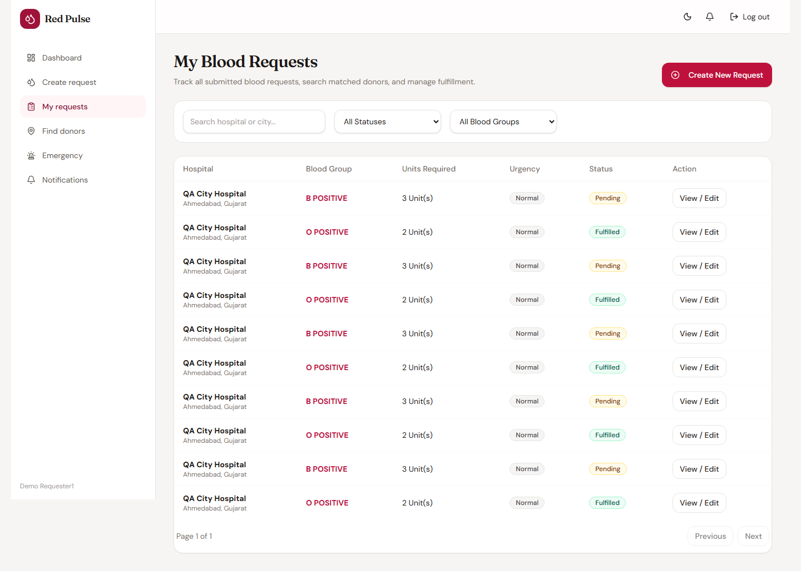 | 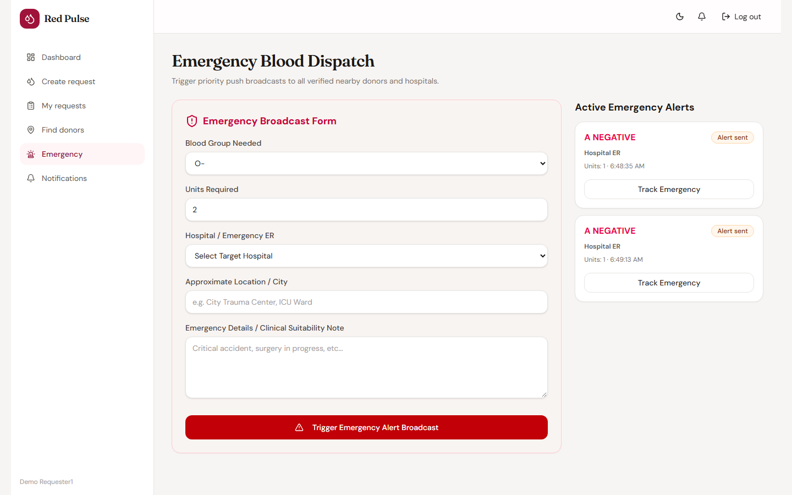 |

---

## Tech stack

**Backend** — Java 21, Spring Boot 4.1, Spring Web, Spring Data JPA (Hibernate),
Spring Security, Bean Validation, Flyway, jjwt, PostgreSQL, springdoc-openapi (Swagger UI).

**Frontend** — React 19, TypeScript 5.9, Vite 7, React Router 7, TanStack Query 5,
React Hook Form + Zod for validation, Tailwind CSS 4, Recharts, Lucide icons, Axios, Sonner toasts.

---

## Architecture

```
React SPA
   │  Axios, Bearer access token
   ▼
Controllers            thin; validate input, map to DTOs, delegate
   ▼
Services               business rules, transactions, ownership checks
   ▼
Repositories           Spring Data JPA
   ▼
PostgreSQL             schema owned by Flyway
```

Each backend feature is a package under `com.redpulse.modules` (`auth`, `user`,
`hospital`, `donation`, `appointment`, `request`, `inventory`, `matching`,
`notification`, `admin`), split into `controller` / `service` / `repository` /
`entity` / `dto`. Cross-cutting code lives under `com.redpulse.common` (security,
exceptions, rate limiting, audit, phone validation).

A few decisions worth calling out:

**The database owns the schema.** Flyway migrations `V1`–`V9` create every
table. Hibernate runs with `ddl-auto: validate`, so a mismatch between the
entities and the migrations fails at startup rather than silently altering tables.

**Business rules live in the service layer, not the controller.** For example,
completing a donation increments hospital stock, updates the donor's cooldown and
moves the appointment forward, all inside one transaction. The controller has no
opinion about it.

**Ownership is checked server-side.** Services compare the record's donor or
hospital against the authenticated actor and throw `ForbiddenException` when they
do not match, so a donor cannot read another donor's donations by guessing an id.
There are 3 such checks in `DonationService`, 3 in `AppointmentService` and 2 in
`NotificationService`.

**Matching is a server concern.** `MatchingService` scores donors against a blood
request and the donor's location, so the browser only renders the result.

---

## Roles and permissions

| Role | What it can do |
|---|---|
| **Donor** | Maintain a health profile, set availability, book appointments, donate, view donation history, contributions, milestones and badges, view nearby blood requests |
| **Hospital** | Manage stock per blood group, view and edit facility details, see appointments for the facility, confirm / complete / no-show, review incoming blood requests, confirm donations and credit stock |
| **Requester** | Raise blood requests against a hospital, track status and matched donors, trigger an emergency broadcast, view notifications |
| **Admin** | Verify donors, block and unblock users, manage hospitals, view platform-wide analytics and reports, read the audit trail |

Role checks are applied with Spring Security request matchers and `@PreAuthorize`
on the admin controllers. The frontend also gates routes by role, but that is
presentation only — the API is what actually enforces access.

---

## Authentication and security

- **Stateless JWT.** `JwtUtils` issues a short-lived access token (15 minutes by
  default) and a longer refresh token. Tokens are signed with an HS key supplied
  via `JWT_SECRET`; the app refuses to start without it.
- **Separate access and refresh lifetimes**, both configurable.
- **BCrypt** for password hashing (`PasswordEncoder` bean in `ApplicationConfig`).
- **Stateless sessions** — `SessionCreationPolicy.STATELESS`, no server-side session
  store.
- **Layered authorization** — URL matchers for broad areas, `@PreAuthorize` on
  admin controllers, and per-record ownership checks in services.
- **Validation at the boundary** — Bean Validation annotations on every request
  DTO, enforced with `@Valid` in the controllers, with a single exception handler
  returning one consistent error shape.
- **Firebase phone auth** is wired as an alternative sign-in path
  (`FirebaseTokenService` verifies the ID token server-side).

### Known gaps

Stating these plainly rather than implying they are handled:

- **CSRF protection is disabled** (`csrf.disable()`). Acceptable for a pure
  bearer-token API where the browser never attaches credentials automatically,
  but it must be revisited if cookie-based auth is ever added.
- **The audit trail is read-only today.** The schema, entity, repository, four
  endpoints and the admin page all exist, and `AdminService` writes one entry, but
  the AOP hook that was meant to record every privileged action is an empty
  placeholder (`common/audit/AuditAspect.java`). The page therefore renders an
  empty table.
- **No rate limiting on auth endpoints.** Nothing throttles repeated login
  attempts.
- A handful of classes under `common` and `enums` are empty placeholders left
  over from the original scaffold.

---

## API

96 endpoints across 15 controllers. Grouped by area:

| Area | Base path |
|---|---|
| Authentication | `/api/auth` — register, login, refresh, forgot/reset password |
| Users and profiles | `/api/users`, `/api/donors` |
| Hospitals | `/api/hospitals` |
| Inventory | `/api/hospitals/{id}/inventory` |
| Donations | `/api/donations` |
| Appointments | `/api/appointments` |
| Blood requests | `/api/blood-requests` |
| Matching | `/api/blood-requests/{id}/matches`, `/api/donors/nearby` |
| Emergencies | `/api/emergency-requests`, `/api/emergency/otp` |
| Notifications | `/api/notifications` |
| Admin and audit | `/api/admin` |

Interactive API docs are served at `/swagger-ui.html` when the app is running.

---

## Database

PostgreSQL, 15 tables across 9 Flyway migrations.

| Migration | Contents |
|---|---|
| `V1` | users, donor profiles, password reset tokens |
| `V2` | hospitals, blood inventory |
| `V3` | blood requests, emergency requests |
| `V4` | appointments, donations |
| `V5` | notifications, audit logs |
| `V6` | indexes and constraints |
| `V7` | Firebase UID on users |
| `V8` | emergency email verification |
| `V9` | appointment lifecycle columns |

Relationships worth noting: a `donation` belongs to a donor and a hospital and may
trace back to an `appointment`; completing one is what moves inventory. A
`blood_request` targets a hospital and accumulates matched donors; escalating it
creates an `emergency_request`. Appointments link a donor to a hospital slot and
progress `SCHEDULED → CONFIRMED → COMPLETED`, with `NO_SHOW` and `CANCELLED` as
terminal alternatives.

---

## Project structure

```
.
├── Red Pulse-Frontend/          React + TypeScript SPA (Vite)
│   ├── src/
│   │   ├── api/                 Axios client, endpoint modules, shared contracts
│   │   ├── components/          Layout, tables, forms, cards
│   │   ├── context/             Auth and theme providers
│   │   ├── pages/               One folder per role: donor, hospital, requester, admin, public
│   │   ├── routes/              Route table and role guards
│   │   ├── types/               Shared enums and models
│   │   └── __tests__/           Vitest suites
│   └── package.json
│
├── Red-Pulse Backend/           Spring Boot API (Maven)
│   └── red-pulse/
│       ├── src/main/java/com/redpulse/
│       │   ├── modules/         Feature packages, each with controller/service/repository/entity/dto
│       │   ├── common/          Security, exceptions, audit, config
│       │   ├── config/          Security, mail, data initialisation
│       │   └── enums/           Status and domain enums
│       ├── src/main/resources/
│       │   ├── db/migration/    Flyway migrations V1-V9
│       │   └── application*.yml
│       └── pom.xml
│
├── docs/screenshots/            Images used by this README
├── .gitignore
└── README.md
```

---

## Running it locally

**Prerequisites:** JDK 21, Node 20+, and a PostgreSQL database you can create
tables in.

**Backend**

```bash
cd "Red-Pulse Backend/red-pulse"

# copy the template and fill it in
cp .env.example .env

# the app reads .env directly (spring.config.import), so the values below
# are what it needs:
#   DB_URL, DB_USERNAME, DB_PASSWORD
#   JWT_SECRET                 (base64; openssl rand -base64 48)
#   JWT_ACCESS_TOKEN_EXPIRATION, JWT_REFRESH_TOKEN_EXPIRATION
#
# NOTE: this build reads the two expiry values as milliseconds, not
# as ISO-8601 durations - 900000 is 15 minutes.

./mvnw spring-boot:run
```

The API comes up on `http://localhost:8080` and Swagger UI at
`http://localhost:8080/swagger-ui.html`. Flyway applies the migrations on first
start and Hibernate then validates the schema against them.

**Frontend**

```bash
cd "Red Pulse-Frontend"
npm install
npm run dev
```

The app is served on `http://localhost:5173` and proxies API calls to the backend.

**Checks**

```bash
# backend - 7 tests
cd "Red-Pulse Backend/red-pulse" && ./mvnw test

# frontend - 9 tests
cd "Red Pulse-Frontend"
npx tsc -b        # typecheck (also runs as part of `npm run build`)
npm run lint
npm test
```

### Bootstrap an admin

Set `ADMIN_BOOTSTRAP_ENABLED=true` plus `ADMIN_EMAIL` and `ADMIN_PASSWORD` and the
app creates one admin account on first start. Intended for local development.

---

## Tests

Backend: 7 JUnit tests, all passing — application context startup, OTP store
behaviour, Indian phone number normalisation, and auth-service validation.

Frontend: 9 Vitest tests across 4 suites, all passing — auth, blood requests,
inventory and the route table. `npx tsc -b` and `npm run lint` are clean (lint
reports two `react-refresh` warnings, no errors).

Coverage is thinner than the feature list: the service-layer rules that matter
most — donation completion crediting stock, the donor cooldown calculation, and
appointment state transitions — are exercised through the running application but
do not yet have unit tests behind them. That is the obvious next thing to add.

## Licence

See [LICENSE](LICENSE).
